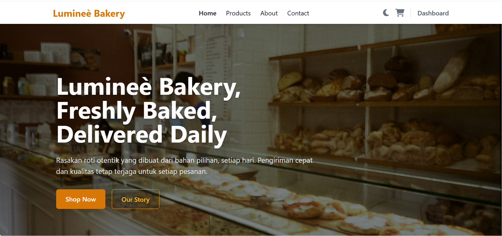
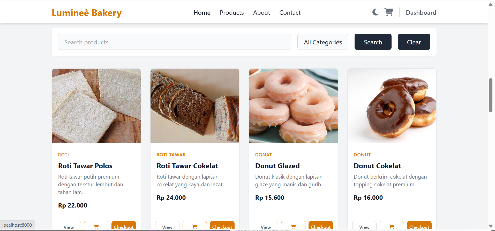
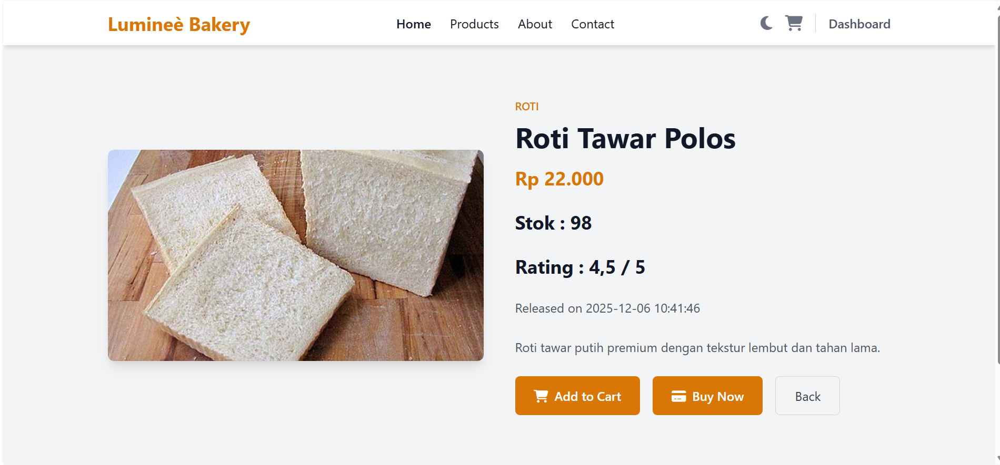
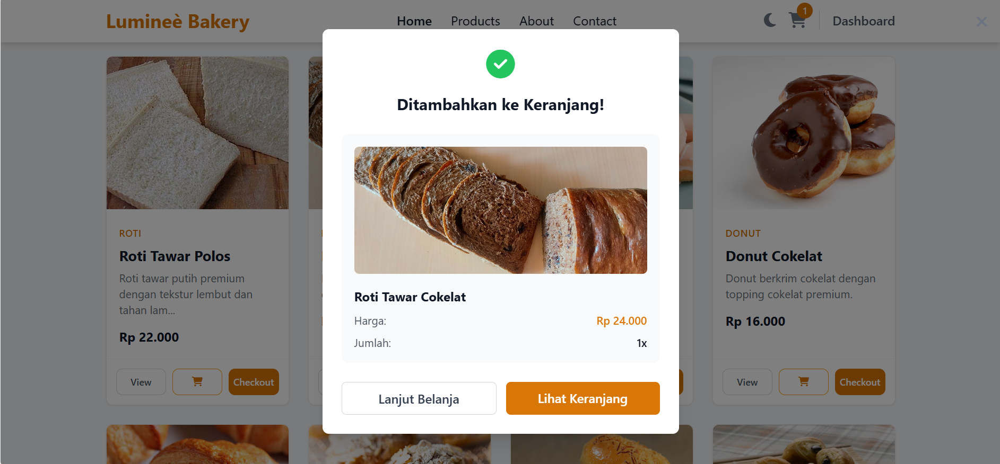
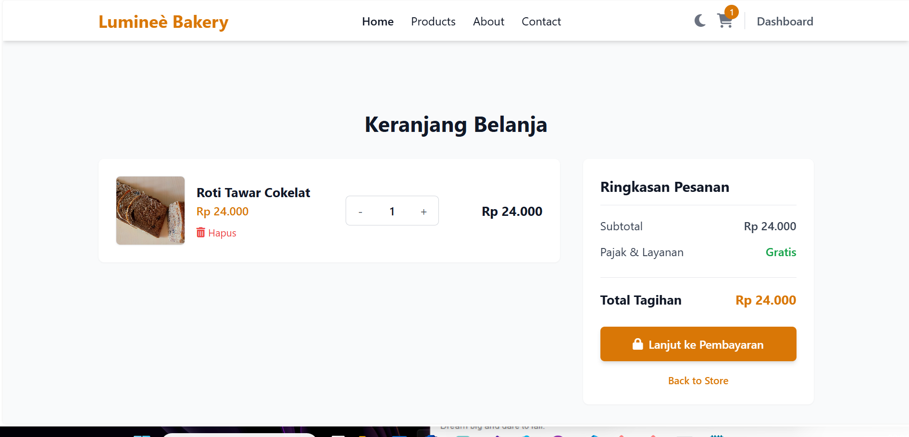
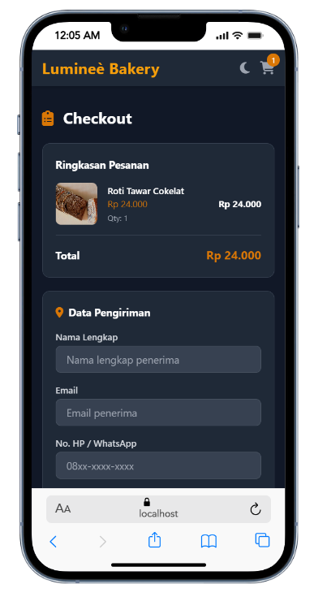
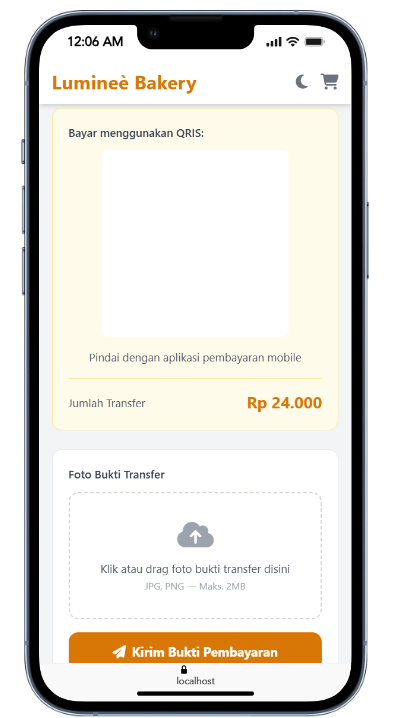

<div align="center">


<br/>

</div>

---

## Tech Stack & Tools

<div align="center">


</div>
>>>  Rebuild modern project menggunakan **Laravel 13** dengan arsitektur scalable & clean code.

---

## Permasalahan 

Pada tahap awal pengembangan, sistem Bakery yang kami bangun menggunakan PHP Native berjalan dengan cukup baik untuk kebutuhan dasar seperti manajemen produk dan pemesanan sederhana.

Namun, seiring dengan berkembangnya fitur dan meningkatnya kompleksitas sistem, mulai muncul beberapa kendala diantaranya :
- Struktur kode tidak terorganisir
Tidak adanya pola arsitektur yang jelas (seperti MVC) membuat kode sulit dipelihara dan dikembangkan.
- Sulit melakukan scaling fitur
Penambahan fitur seperti laporan keuangan, multi-role user, dan API menjadi semakin kompleks dan rawan bug.
- Redundansi kode (code duplication)
Banyak fungsi yang ditulis berulang karena tidak adanya sistem modular yang baik.
- Keamanan terbatas
Harus melakukan handling manual untuk validasi, sanitasi input, dan proteksi seperti CSRF.
- Manajemen database kurang optimal
Query ditulis manual tanpa ORM sehingga lebih rentan error dan sulit dikelola dalam jangka panjang.
- Gaya Code
Tanpa standar struktur project, setiap developer memiliki gaya masing-masing sehingga sulit sinkronisasi.

---

## Solusi Yang Ditawarkan
Adapun Solusi yang ditawarkan dari permasalahan tersebut adalah migrasi total ke Laravel, Awalnya refactor akan di arahkan ke Go & React, namun dalam pertimbangan lebih lanjut Sistem akan di refactor ke arah laravel. yang menawarkan Arsitektur MVC (Model-View-Controller)
Membuat kode lebih terstruktur, rapi, dan mudah dikembangkan. Interaksi database menjadi lebih mudah, aman, dan readable tanpa query manual yang kompleks. Mempermudah pengelolaan endpoint baik untuk web maupun API. build in security otomatis blade template engine, Migration & Seeder
Memudahkan manajemen database dan setup project untuk tim. serta struktur project yang cukup rapi untuk diselesaikan bersama sama dengan gaya code yang berbeda

---

## Perbedaan dengan Versi Asli

Proyek ini adalah refactor dari [github.com/Theikol/Bakery](https://github.com/Theikol/Bakery) dengan perbaikan:

| Aspek | Versi Asli | Versi Refactor |
|-------|------------|----------------|
| **Arsitektur** | PHP Procedural | Laravel MVC Framework |
| **Database** | SQL Langsung | Eloquent ORM |
| **Frontend** | JS & PHP Native | Tailwind CSS + Alpine.js |
| **Authentication** | Custom Auth | Laravel Breeze |
| **Testing** | Tidak ada | Pest PHP |
| **Dashboard** | Basic | Advanced Analytics |
| **File Management** | Manual | Laravel Storage |
| **Deployment** | Manual | Automated Scripts |

---

##  Preview


---

##  Tentang Project

**Bakery Management System** adalah sistem terintegrasi untuk:

*  Ecommerce (Order System)
*  Management Produk
*  Laporan Keuangan
*  Company Profile

Project ini merupakan hasil **refactor & rebuild total** dari versi native PHP menjadi **Laravel Framework**.

---

##  Team Members

| Nama                  | Role                     |
| --------------------- | ------------------------ |
| Adrian Haikal Akbar   | Database Engineer        |
| Amanda Putri Kusuma   | Documentation Specialist |
| Chyntia Assyifa       | UI/UX Designer           |
| Dwi Fitriyanti        | QA Engineer              |
| Fajar Sidik           | Project Manager          |
| Nur Alya Syahrani     | Frontend Developer       |
| Ricky Prayoga Saputra | Backend Developer        |

---

##  Struktur Folder Laravel

```
BakeryRefactor/
├── app/
│   ├── Http/
│   │   ├── Controllers/
│   │   │   ├── ProductController.php
│   │   │   ├── CartController.php
│   │   │   └── OrderController.php
│   ├── Models/
│   │   ├── Product.php
│   │   ├── Order.php
│   │   └── OrderItem.php
│
├── database/
│   ├── migrations/
│   ├── seeders/
│   │   ├── DatabaseSeeder.php
│   │   └── ProductSeeder.php
│
├── routes/
│   ├── web.php
│   └── api.php
│
├── resources/
│   ├── views/
│   │   ├── home.blade.php
│   │   ├── checkout.blade.php
│   │   └── components/
│
├── public/
├── config/
└── .env
```

---

##  Instalasi & Setup

### 1. Clone Repository

```bash
git clone https://github.com/your-repo/bakery.git
cd bakery
```

### 2. Install Dependency

```bash
composer install
npm install && npm run dev
```

### 3. Setup Environment

```bash
cp .env.example .env
php artisan key:generate
```

### 4. Konfigurasi Database

Edit file `.env`:

```
DB_DATABASE=bakery
DB_USERNAME=root
DB_PASSWORD=
```

### 5. Migration & Seeder

```bash
php artisan migrate
php artisan db:seed
```

### Contoh Seeder

```php
class ProductSeeder extends Seeder
{
    public function run()
    {
        Product::create([
            'name' => 'Croissant',
            'price' => 15000,
            'category' => 'Pastry'
        ]);
    }
}
```

### 6. Jalankan Server

```bash
composer run dev
```

---

##  Fitur Utama

###  Frontend

* Responsive UI
* Product Grid + Image
* Search & Filter
* Modal Detail
* Cart (Session)
* Checkout System

###  Backend Laravel

* REST API
* MVC Architecture
* Eloquent ORM
* Validation
* Secure Session

---

##  API (Laravel)

### Product

```
GET /api/products
GET /api/products/{id}
```

### Cart

```
POST /api/cart/add
POST /api/cart/remove
GET /api/cart
```

### Order

```
POST /api/checkout
GET /api/orders
```

---

##  UI Design System

| Role      | Color   |
| --------- | ------- |
| Primary   | #d4a574 |
| Secondary | #8b4513 |
| Light     | #f5e6d3 |
| Dark      | #2c1810 |

---

##  Security

* CSRF Protection (Laravel)
* Validation Rules
* Eloquent ORM (anti SQL Injection)
* Session Secure Handling

---

##  Roadmap

* [ ] Authentication (Laravel Breeze / Jetstream)
* [ ] Admin Dashboard
* [ ] Payment Gateway
* [ ] Email Notification
* [ ] Order Tracking

---

## Application Preview

### Home


### Products Page


### Prieview Product


### Cart


### Process


### Ceckout


### Payment Gateway


### Admin & Database ? ahh it looks like it's already night :)

##  The Refactor

- **Theikol** - *Initial work* - [github.com/Theikol](https://github.com/Theikol)

---

##  Contact

 [ikoladrian@gmail.com](mailto:ikoladrian@gmail.com)

---

##  Made With Me

> "Good code is like good bread - simple, clean, and satisfying." 🥖✨
